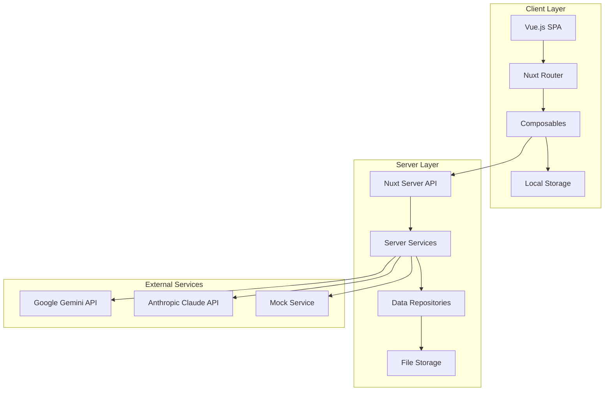
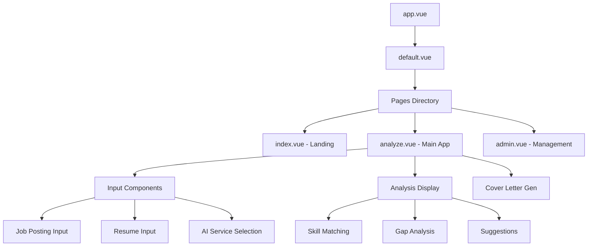
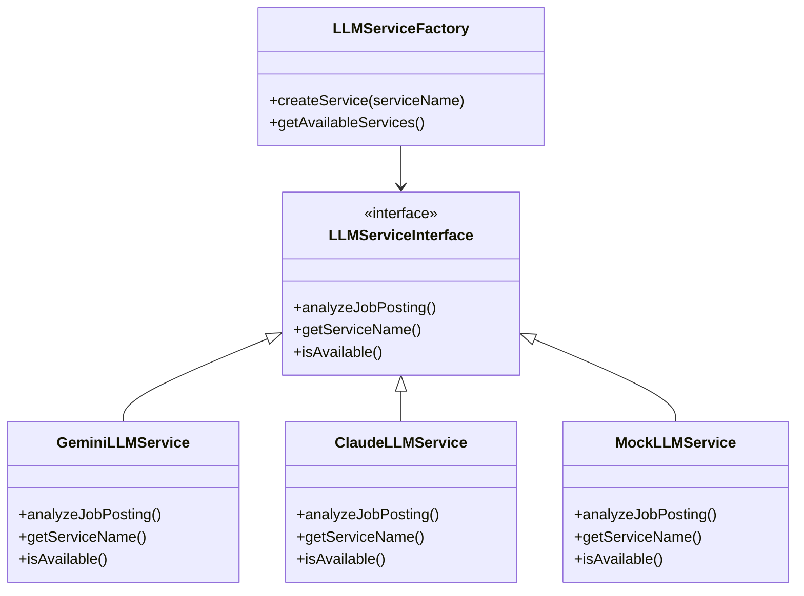
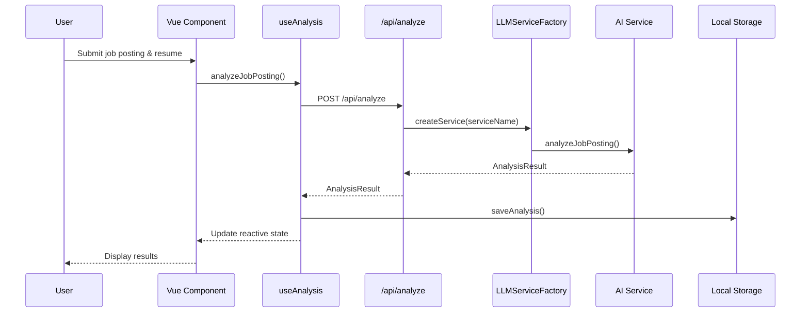
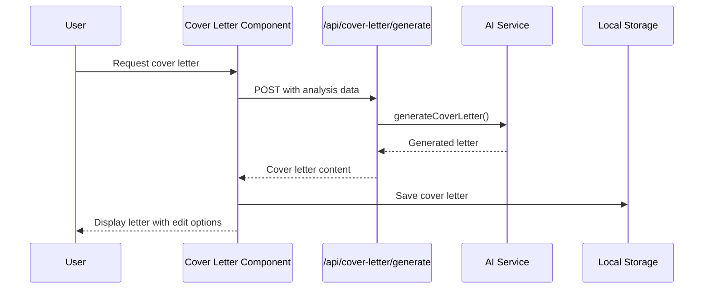
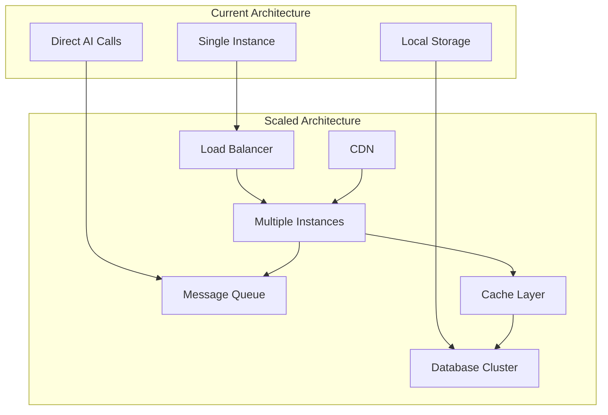
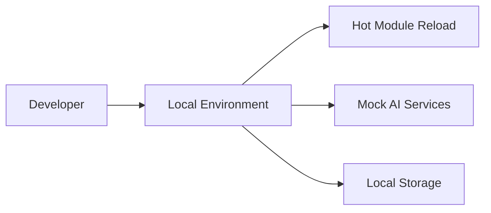
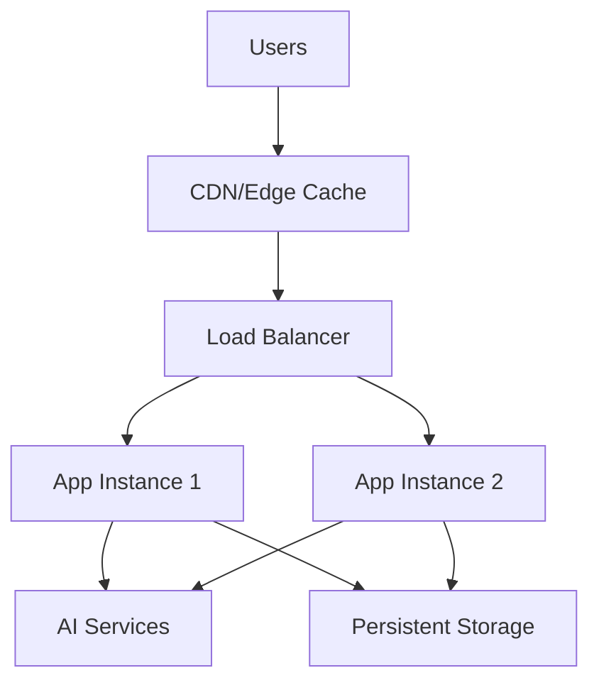
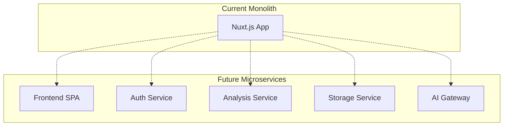

# Architecture Overview

*Part of Repository Analysis - July 1, 2025*

## System Architecture

The Job Posting Analyzer follows a modern full-stack architecture with clear separation of concerns and pluggable AI service integration.



## Component Architecture

### Frontend Components



### Service Layer Architecture



## Data Flow Architecture

### Analysis Request Flow



### Cover Letter Generation Flow



## Key Architectural Decisions

### 1. AI Service Abstraction

**Decision**: Implement pluggable AI service architecture
**Rationale**: 
- Multiple AI providers with different strengths
- Future-proofing against API changes
- Cost optimization through provider switching
- Fallback capabilities

**Implementation**:
```typescript
interface LLMServiceInterface {
  analyzeJobPosting(jobPosting: JobPosting, resume: Resume): Promise<AnalysisResult>;
  getServiceName(): string;
  isAvailable(): Promise<boolean>;
}
```

### 2. Client-Side Storage Strategy

**Decision**: Use local storage for MVP
**Rationale**:
- Rapid prototyping and development
- No backend complexity
- Privacy-first approach
- Offline capability

**Trade-offs**:
- Limited to single device
- Storage size constraints
- No collaboration features

### 3. Nuxt.js Full-Stack Architecture

**Decision**: Use Nuxt.js for both frontend and API
**Rationale**:
- Single framework for full stack
- Built-in API routes
- Excellent TypeScript support
- Deployment simplicity

### 4. File-Based Server Storage

**Decision**: JSON files for server-side persistence
**Rationale**:
- Simple deployment
- No database overhead
- Easy backup and migration
- Development simplicity

## Component Patterns

### 1. Composition API Pattern

```typescript
// Consistent composable pattern
export function useAnalysis() {
  const state = reactive({...});
  const loading = ref(false);
  
  const methods = {
    async analyzeJob() { ... },
    async saveAnalysis() { ... }
  };
  
  return {
    // Reactive state
    ...toRefs(state),
    loading,
    // Methods
    ...methods
  };
}
```

### 2. Service Layer Pattern

```typescript
// Consistent service interface
abstract class BaseLLMService implements LLMServiceInterface {
  protected abstract apiKey: string;
  protected abstract modelName: string;
  
  abstract analyzeJobPosting(): Promise<AnalysisResult>;
  
  // Shared functionality
  protected handleError(error: Error): never {
    // Consistent error handling
  }
}
```

### 3. Repository Pattern

```typescript
// Data access abstraction
export class AnalysisRepository {
  async save(analysis: SavedAnalysis): Promise<void> { ... }
  async findById(id: string): Promise<SavedAnalysis | null> { ... }
  async findAll(): Promise<SavedAnalysis[]> { ... }
  async delete(id: string): Promise<void> { ... }
}
```

## Security Architecture

### Current Security Measures

1. **API Key Management**
   - Server-side only storage
   - Environment variable configuration
   - No client-side exposure

2. **Input Validation**
   - Basic content length limits
   - File type restrictions
   - Sanitization (needs improvement)

3. **CORS Configuration**
   - Default Nuxt CORS settings
   - Needs tightening for production

### Security Gaps

1. **Rate Limiting**: Not implemented
2. **Input Sanitization**: Incomplete
3. **CSP Headers**: Not configured
4. **Authentication**: Not implemented

## Performance Architecture

### Current Optimizations

1. **Lazy Loading**
   - Components loaded on demand
   - Route-based code splitting

2. **Caching**
   - Local storage for repeated data
   - Browser caching for static assets

3. **Bundle Optimization**
   - Nuxt's built-in optimizations
   - Tree shaking enabled

### Performance Bottlenecks

1. **PDF Processing**: Blocks main thread
2. **Large Responses**: No pagination
3. **Multiple AI Calls**: No batching

## Scalability Considerations

### Current Limitations

1. **Storage**: Local storage size limits
2. **Concurrent Users**: No load balancing
3. **AI Services**: No queue management
4. **File Processing**: Memory constraints

### Scaling Strategy



## Technology Stack Rationale

### Frontend Stack

| Technology | Reason | Alternatives Considered |
|------------|--------|------------------------|
| Nuxt.js 3 | Full-stack capabilities, TypeScript support | Next.js, Vite+Vue |
| Vue.js 3 | Composition API, reactivity | React, Svelte |
| TypeScript | Type safety, better tooling | JavaScript |
| Tailwind CSS | Utility-first, rapid development | Bootstrap, Styled Components |

### Backend Stack

| Technology | Reason | Alternatives Considered |
|------------|--------|------------------------|
| Nitro | Nuxt's server engine | Express.js, Fastify |
| Node.js 23 | Latest features, performance | Node.js 18/20 |
| File Storage | Simplicity, no dependencies | PostgreSQL, MongoDB |

### AI Integration

| Service | Reason | Alternatives |
|---------|--------|--------------|
| Google Gemini | Good performance, competitive pricing | OpenAI GPT |
| Anthropic Claude | Strong reasoning, safety focus | OpenAI GPT |
| Mock Service | Development, testing | N/A |

## Deployment Architecture

### Development Environment



### Production Environment



## Future Architecture Considerations

### 1. Microservices Evolution



### 2. Event-Driven Architecture

For future scalability, consider implementing event-driven patterns:

- Analysis completion events
- User activity tracking
- Async processing queues
- Real-time notifications

### 3. API Gateway Pattern

As the system grows, implement an API gateway for:

- Rate limiting
- Authentication/authorization
- Request routing
- Response caching
- Monitoring and analytics

---

This architecture overview provides the foundation for understanding the current system and planning future enhancements. The modular design allows for incremental improvements while maintaining system stability.
